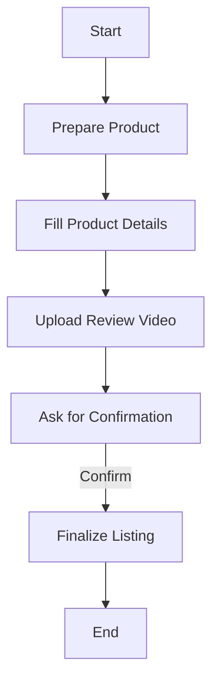
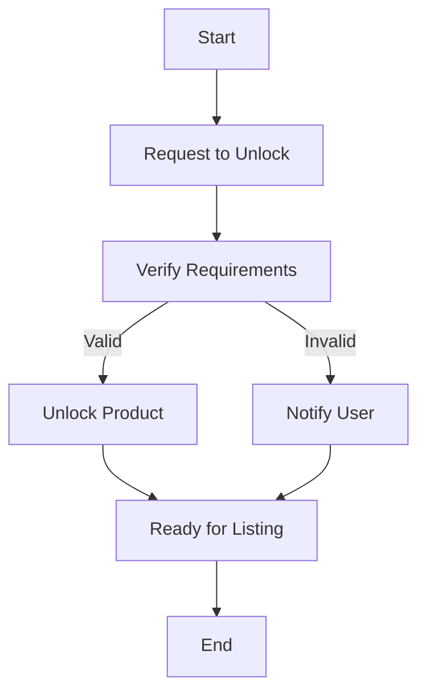

# User Product Workflow Guide

## Introduction
This guide provides an integrated user manual for both new and experienced users of the Shopreneur product listing workflow. It outlines the necessary steps to publish products, including critical requirements and avoids common pitfalls.

## Step-by-Step Workflow

### 1. Preparing Your Product
   - Gather product details: title, description, images, and pricing.
   - Ensure you have the required 2 units: 1 personal and 1 inventory.

### 2. Listing the Product
   - Navigate to the product listing section in your Shopreneur dashboard.
   - Fill in the required fields with accurate information. 
   - **Important**: Review your entries before proceeding.

### 3. Review Video Requirement
   - Upload a review video demonstrating the product features.

### 4. Confirmation Step
   - **Ask Before Listing**: A confirmation dialog will appear before finalizing your listing. Ensure all details are correct.
   - Click **Confirm** to complete the listing process.

## FAQ
**Q: What is the ‘ask before listing’ step?**  
A: It's a confirmation dialog that ensures all details are verified before products go live.

**Q: How many products can I list at once?**  
A: You can list multiple products, but ensure you meet the 2-unit rule for each product.

**Q: Do I need to upload a video for every product?**  
A: Yes, a review video is required for each product listing.

## Mermaid Diagrams
### Product Listing Workflow

### Unlock/Publish Flow

## Conclusion
By following this guide, you can seamlessly navigate the product listing process, ensuring compliance with Shopreneur’s requirements and enhancing user experience.